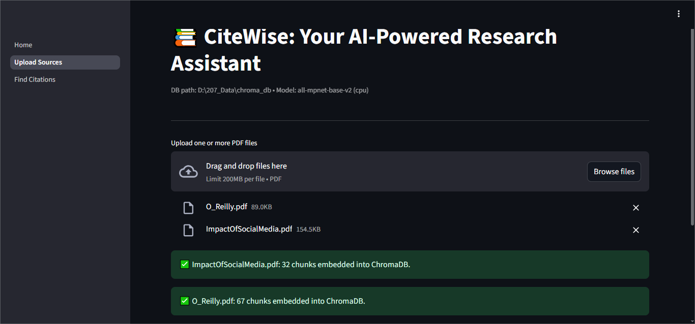
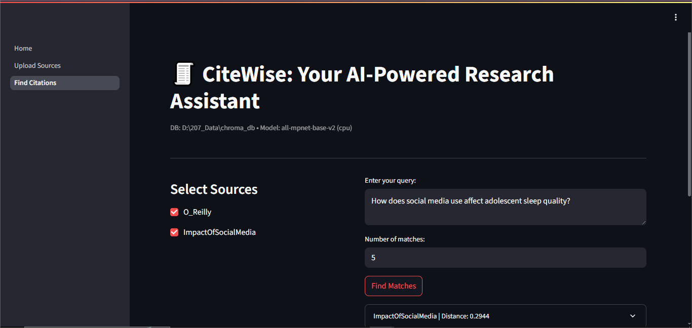
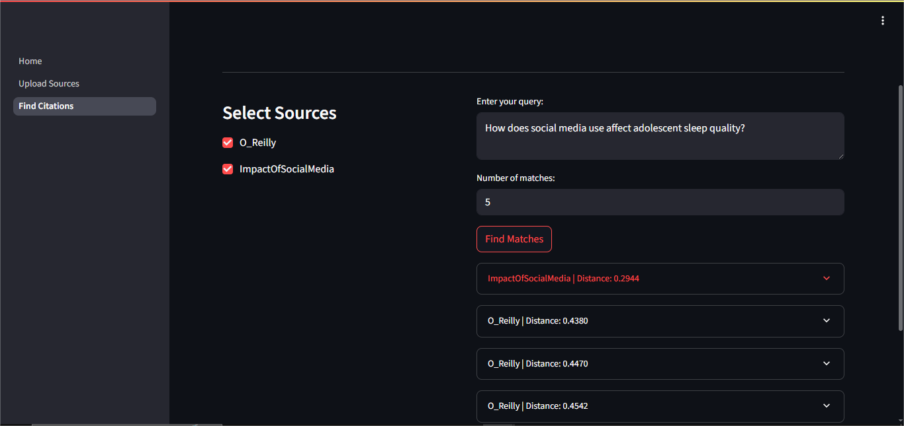
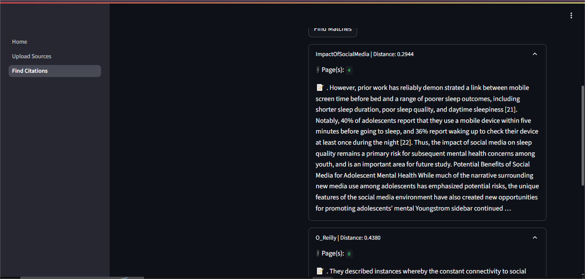
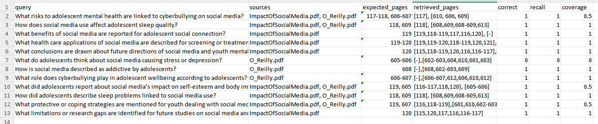
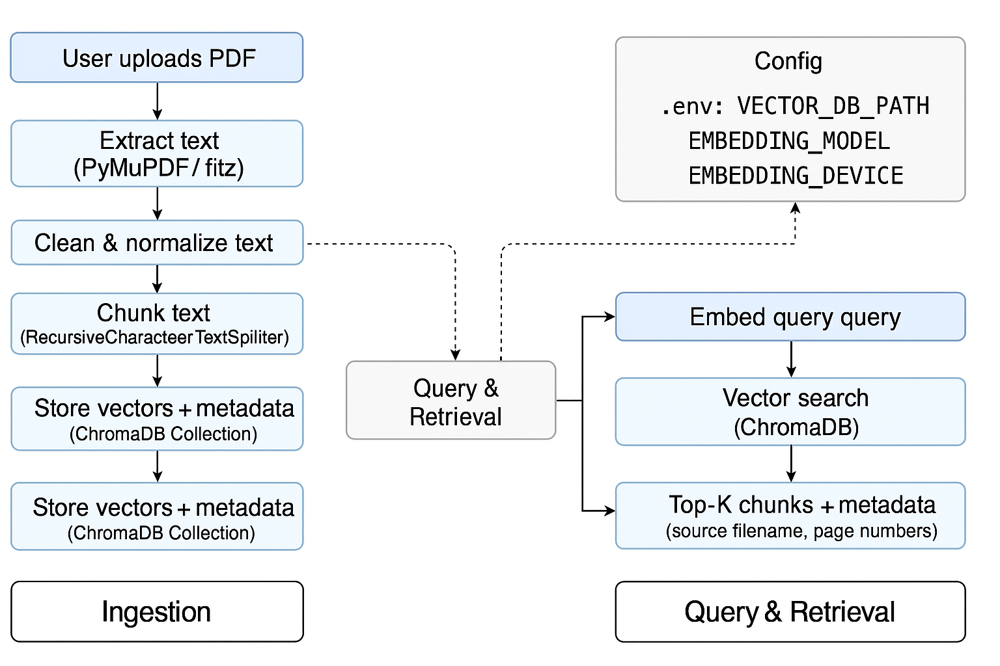

# 📚 CiteWise — Local AI Research Companion  

**CiteWise** is a **local-first, privacy-friendly AI assistant** that helps researchers and students work with PDF research papers.  
It extracts, chunks, embeds, and stores text in a **ChromaDB** vector database, enabling **semantic search with citation metadata** (paper + page numbers).  

---

## ✨ Features  

- 📄 **Upload PDFs** — Extract, clean, and chunk text  
- 🔍 **Semantic Search** — Retrieve top-K passages using embeddings  
- 📑 **Citation Metadata** — Every result includes **source file + page number(s)**  
- 💻 **Local-first** — All processing & storage is on your machine  
- ⚡ **Configurable** — Model, device, and DB path via `.env`  
- 📊 **Evaluation Framework** — Recall/coverage scoring with CSV logs  
- 🖼️ **Streamlit UI** — Simple and intuitive interface  

---

## 🛠️ Tech Stack  

- **Python 3.11+**  
- **Streamlit** — interactive UI  
- **ChromaDB** — local vector database  
- **Sentence-Transformers** (`all-mpnet-base-v2`) — embeddings  
- **LangChain** — text splitting utilities  
- **PyMuPDF (fitz)** — PDF parsing  
- **dotenv** — environment variable config  

---

## 🚀 Quickstart  

```bash
# 1. Clone repo
git clone https://github.com/yourname/CiteWise.git
cd CiteWise

# 2. Setup venv
python -m venv venv
source venv/bin/activate   # (or venv\Scripts\activate on Windows)

# 3. Install requirements
pip install -r requirements.txt

# 4. Configure env
cp .env.example .env
# edit VECTOR_DB_PATH, EMBEDDING_MODEL if needed

# 5. Run app
streamlit run Home.py
```


## 📊 Evaluation Metrics

We evaluated CiteWise on 12 manually designed queries across two papers.  
Correctness was judged based on whether the retrieved chunks matched the expected source and page(s).

| Metric        | Value             |
|---------------|-------------------|
| **Queries**   | 12                |
| **Recall@5**  | 11 / 12 = 91.7%   |
| **Coverage**  | 9.5 / 12 ≈ 79%    |

📂 Detailed results: [`evaluation/eval_results.csv`](evaluation/eval_results.csv)


## 📸 Screenshots

### 1. Upload PDFs  

<p float="left">
  
  
</p>

### 2. Query & Citation Results  

<p float="left">
  
   
  
</p>
<p float="left">

</p>

### 3. Evaluation Metrics  


## 🏗️ Architecture Diagram  

The flow below illustrates how CiteWise processes research papers into a local semantic search pipeline:  

1. **PDF Upload** → User uploads one or more research papers.  
2. **Chunking** → Text is extracted per page, cleaned, and split into overlapping chunks.  
3. **Embedding** → Each chunk is encoded into a dense vector using SentenceTransformers.  
4. **Storage** → Embeddings, metadata (page, source, chunk_id), and text are stored in a local **ChromaDB** collection.  
5. **Query** → User enters a natural language query.  
6. **Retrieve** → Top-K similar chunks are retrieved from selected collections.  
7. **Display** → Results are shown in the UI with citation metadata (source + page numbers).  

<p float="left">
  
  
</p>


## ⚠️ Limitations & Roadmap  

### Current Limitations  
- **No deletion of sources**: Once PDFs are embedded, they remain in ChromaDB unless manually cleared.  
- **Evaluation is semi-manual**: Current evaluation uses curated queries; automated test harness is minimal.  
- **No re-ranking or LLM integration**: Retrieval is based purely on vector similarity; no advanced reranking or reasoning step.  
- **UI simplicity**: Streamlit UI is functional but minimal, lacking features like highlighting exact match spans.  

### Roadmap  
- 📈 Run automated evaluation with a larger number of queries for more robust benchmarking.  
- 🔄 Implement source deletion/management directly in the UI.  
- 🔍 Explore re-ranking with lightweight LLM calls for improved citation precision.  
- 🧠 Add intelligent CID (character ID) replacement with optional user input/feedback loop.  


